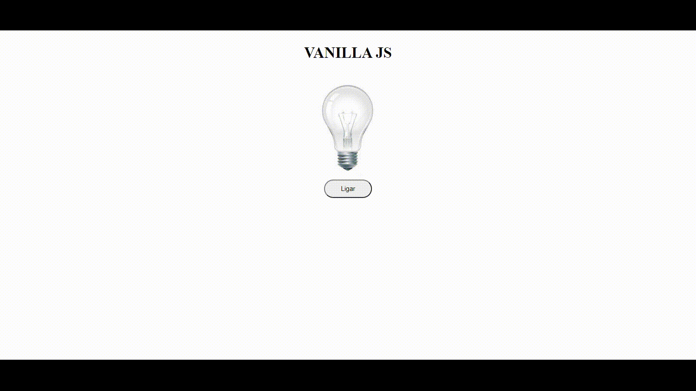

<h1 align="center">
  
</h1>

## 🚀 Tecnologias

Esse projeto foi desenvolvido com as seguintes tecnologias:

- HTML
- CSS
- JavaScript

## 💻 Projeto

Exercicio de javascript onde ao clicar no botão poderar ligar ou desligar a lampada e ao passar o mouse por cima tambem sera possivel liga-la ou desliga-la, e danndo doble click ela quebra e nao pode ser mais ligada.

## 🔖 Layout
Você pode visualizar o projeto  através [desse link](https://cleitonbarros.github.io/Lampada-/).

